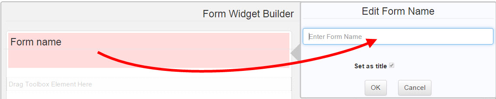
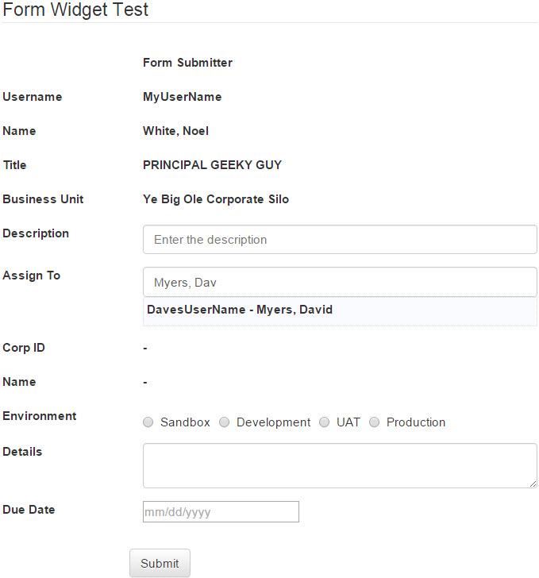

Jive - Form Widget
==================
<p></p>
The ExportContainers widget helps create content within Jive with consistent ExportContaineratting and controlled inputs.  This is a [Jive](https://community.jivesoftware.com/welcome) HTML widget project that creates a builder application allowing users to drag & drop [Bootstrap](http://getbootstrap.com/) elements to create a ExportContainer design.  The widget works with Jive content types, enables categorizing and tagging, and allows attachments to be included.  ExportContainer designs can be saved and reloaded later to modify the ExportContainer.  Each submitted ExportContainer creates a unique document with a table of the ExportContainer fields with the user’s entered inExportContaineration.  This makes it easy to guide users what to submit as well as making the submissions much easier to process.
      
Prerequisite
------------
The [Content Lookup](https://github.com/fmr-llc/jive-content-lookup) widget installation has essential parts of setting up this widget project.  Make sure to install the Content Lookup widget prior to continuing with the Form installation.

Download Bootstrap-Datepicker
-----------------------------
[Bootstrap-Datepicker](https://github.com/eternicode/bootstrap-datepicker) is a library that the form uses for a date picking user interface.  You need to obtain a copy of this library and store specific files in your Jive instance for use.  Follow these instructions to download the latest version and upload to your community:

* Click [Bootstrap-Datepicker download](https://github.com/eternicode/bootstrap-datepicker/archive/master.zip) to get the latest version or use a version used by your front end developers.
* (Optional) Perform any required security checks on the downloaded code.
* Extract the zip file to your computer.
* Log into your Jive community.
* Navigate to the upload location for your library files.
* Create an Uploaded File in the Library location of your Jive community.  Look in the Bootstrap Datepicker archive on your computer.  Expand the dist folder.  Expand the css folder.  Drag the file "bootstrap-datepicker.min.css" to the file section of the upload.  Set the file name to "Bootstrap Datepicker CSS Library", put a description of your choosing, tag it, set the authors, and make sure it is being published to the correct Library location.  Click Publish.
* Create another Uploaded File in the Library location of your Jive community.  Go back to the Bootstrap Datepicker archive.  Go up to the dist folder, and expand the js folder.  Drag the file "bootstrap-datepicker.min.js" to the file section of the upload.  Set the file name to "Bootstrap Datepicker JavaScript Library", put a description of your choosing, tag it, set the authors, and make sure it is being published to the correct Library location.  Click Publish.

Download jQuery-Placeholder
---------------------------
[jQuery-Placeholder](https://github.com/mathiasbynens/jquery-placeholder) is a library that the form uses for displaying placeholder text in entry fields in browsewrs that do not yet support the placeholder text automatically.  You need to obtain a copy of this library and store specific files in your Jive instance for use.  Follow these instructions to download the latest version and upload to your community:

* Click [jQuery-Placeholder download](https://github.com/mathiasbynens/jquery-placeholder/archive/gh-pages.zip) to get the latest version or use a version used by your front end developers.
* (Optional) Perform any required security checks on the downloaded code.
* Extract the zip file to your computer.
* Log into your Jive community.
* Navigate to the upload location for your library files.
* Create an Uploaded File in the Library location of your Jive community.  Drag the file "jquery.placeholder.min.js" from the archive to the file section of the upload.  Set the file name to "jQuery Placeholder JavaScript Library", put a description of your choosing, tag it, set the authors, and make sure it is being published to the correct Library location.  Click Publish.

Upload Form Libraries
---------------------
* Extract the form widget zip archive to your local computer if you have not done so already.
* Log into your Jive community.
* Navigate to the upload location for your library files.
* Create an Uploaded File in the Library location of your Jive community.  Drag the file "form_widget.css" to the file section of the upload.  Set the file name to "Form Widget CSS Library", put a description of your choosing, tag it, set the authors, and make sure it is being published to the correct Library location.  Click Publish.
* Create another Uploaded File in the Library location of your Jive community.  Drag the file "form_widget.js" to the file section of the upload.  Set the file name to "Form Widget JavaScript Library", put a description of your choosing, tag it, set the authors, and make sure it is being published to the correct Library location.  Click Publish.
* Create an Uploaded File in the Library location of your Jive community.  Drag the file "form_widget_builder.css" to the file section of the upload.  Set the file name to "Form Widget Builder CSS Library", put a description of your choosing, tag it, set the authors, and make sure it is being published to the correct Library location.  Click Publish.
* Create another Uploaded File in the Library location of your Jive community.  Drag the file "form_widget_builder.js" to the file section of the upload.  Set the file name to "Form Widget Builder JavaScript Library", put a description of your choosing, tag it, set the authors, and make sure it is being published to the correct Library location.  Click Publish.

Update Library Loader
---------------------
* Use the Content Lookup widget to search for "Library Loader".  Click the link to the file in the results.  If it is not found, contact your administrator.
* Download a copy of the "Library Loader" file from your community.  Open it for editing.
* Go back to the Content Lookup widget and search for "Form Widget".  You should see the four library files you uploaded to your community above.
* Find the search result for "Form Widget CSS Library" and copy its Content ID.  It should be a number like 694225.
* Update the library_loader.js file line for "form_widget.css" and update the content ID variable (it should be 0 before updating) to the Content ID you just copied.  The result should look similar to:
```
	libraries['form_widget.css'] = { contentID: '694225' };
```
* Find the search result for "Form Widget JavaScript Library" and copy its Content ID.  It should be a number like 694226.
* Update the library_loader.js file line for "form_widget.js" and update the content ID variable (it should be 0 before updating) to the Content ID you just copied.  The result should look similar to:
```
	libraries['form_widget.js'] = { contentID: '694226' };
```
* Find the search result for "Form Widget Builder CSS Library" and copy its Content ID.  It should be a number like 694227.
* Update the library_loader.js file line for "form_widget_builder.css" and update the content ID variable (it should be 0 before updating) to the Content ID you just copied.  The result should look similar to:
```
	libraries['form_widget_builder.css'] = { contentID: '694227' };
```
* Find the search result for "Form Widget Builder JavaScript Library" and copy its Content ID.  It should be a number like 694228.
* Update the library_loader.js file line for "form_widget_bulder.js" and update the content ID variable (it should be 0 before updating) to the Content ID you just copied.  The result should look similar to:
```
	libraries['form_widget_builder.js'] = { contentID: '694228' };
```
* Use the Content Lookup widget to search for "Bootstrap Datepicker".  You should see the two library files you uploaded to your community previously.
* Find the search result for "Bootstrap Datepicker CSS Library" and copy its Content ID.  It should be a number like 694229.
* Update the library_loader.js file line for "bootstrap-datepicker.css" and update the content ID variable (it should be 0 before updating) to the Content ID you just copied.  The result should look similar to:
```
	libraries['bootstrap-datepicker.css'] = { contentID: '694229' };
```
* Find the search result for "Bootstrap Datepicker JavaScript Library" and copy its Content ID.  It should be a number like 694230.
* Update the library_loader.js file line for "bootstrap-datepicker.js" and update the content ID variable (it should be 0 before updating) to the Content ID you just copied.  The result should look similar to:
```
	libraries['bootstrap-datepicker.js'] = { contentID: '694230' };
```
* Use the Content Lookup widget to search for "jQuery Placeholder".  You should see the library you uploaded to your community previously.
* Find the search result for "jQuery Placeholder JavaScript Library" and copy its Content ID.  It should be a number like 694231.
* Update the library_loader.js file line for "jquery-placeholder.js" and update the content ID variable (it should be 0 before updating) to the Content ID you just copied.  The result should look similar to:
```
	libraries['jquery-placeholder.js'] = { contentID: '694231' };
```
* Save the changes to the library_loader.js file on your computer.
* Edit the "Library Loader" uploaded file in your Jive community.
* Drag the updated file from your computer to the file section of the uploaded file.  Click Publish.

You have now updated the Library Loader in your Jive community with the library files needed to run the Form widget.

Install the Form Widget Builder application
-------------------------------------------
* Use the Content Lookup widget to search for "jQuery Library".  Copy the Content ID.  It should be a number like "694224"
* Look in the Form widget archive on your computer and edit the "form_widget_builder.html" file.
* Find the jquery_content_id and replace the zero in the quotes with the Content ID you just copied.  The result should look similar to:
```
	var jquery_content_id = "694224";
```
* Go back to the Content Lookup widget and get the Binary URL for "jQuery Library".  It should look similar to:
```
	https://myjiveinstance.mycompany.com/api/core/v3/attachments/file/694224/data
```
* Edit the "form_widget_builder.html" file again.
* Find the line:
```
    <script src='JQUERY'></script>
```
replace the text JQUERY with the URL you just copied.  It should end up looking similar to:
```
    <script src='https://myjiveinstance.mycompany.com/api/core/v3/attachments/file/694224/data'></script>
```
* Use the Content Lookup widget to search for "Library Loader".  Copy the Content ID.
* Edit the "form_widget_builder.html" file again.
* Find the library_loader_content_id and replace the zero in the quotes with the Content ID you just copied.  The result should look similar to:
```
	var library_loader_content_id = "694223";
```
* Save the file.
* Go to the site you want to put the Form Builder application in your community, and go to the Overview page.
* Manage the Overview page, and drag a new HTML widget onto the page.
* Edit the new HTML Widget.
* Copy the updated code from "form_widget_builder.html" and paste it into the "Your HTML" entry field in the new widget.
* Click "Save Properties".
* Click "Publish Layout".

Your Form Builder is now set up.  Site admins can use the below instructions to create their own Forms...

Build the Form
------------------------
* The starting screen displays an empty form on the left, and a toolbox on the right.
<p></p>
* Click the top Form Name field at the top.  This will switch the Toolbox on the right to reveal the edit properties for the particular field.
<p></p>
  In this case, it displays the Edit Form Name properties which simply has an input field to change the name of the form.  Enter a unique name you would like to give your form, and click OK.  Note that this will be the initial part of the name of the submitted documents posted by the finished form.  It will suffix this with the timestamp the form was submitted (example is at the end).  This will also become the name of the form design in your personal container when you save it.  Once you click OK, the form name will get updated, and the pink background is removed, indicating that the field has been assigned the appropriate values.
* Drag tool elements from the toolbox, and drop them into the form in the area designated with "Drag toolbox Element Here".
<p></p>
  Notice that each element dropped into the form will have a pink "not set" background and an Edit pane opens for the element to the right of where it is dropped.  Once the details are entered, click OK to save the information to the form and the pink background will be removed.  The following tools are available:
  * Form Submitter - This tool is used to display information about the user on the form.  When the form loads, it will look at the users identity and get the selected fields from the user's profile and automatically display the information on the form.  No entry is required.
  * Person Selector - This tool is similar to the Submitter, except it presents a search box where the form user can supply name, ID, etc, and it will look for matching profiles.  A list of matches is returned.  When the form user selects a match from the list, the user's profile information is looked up and the selected fields are displayed in the form.  This field also has a Required check-box, which specifies whether it must be filled in prior to the user submitting the form.
  * Text Block - This allows specific text to  be displayed in the form.  A URL link can also be specified, and the displayed text will be turned into a link to that URL.  Also, the user can opt to have this field NOT be part of the submitted form.  This is useful when providing instructions for users when submitting information, but is not desired in the output form.
  * Text Input - This is a basic text input field.  You can specify the ID of the field, the Label or Heading of the input, as well as the placeholder text, which is what is displayed when the field is empty.  This field also has a Required check-box, which specifies whether it must be filled in prior to the user submitting the form.
  * Text Area - This is a large text input field, when the size of the entry field needs to be more than a single line.  The settings are the same as a Text Input field.
  * Radio Buttons - This creates a set of radio buttons.  This entry is useful when the user must select one of a given number of options.  You can specify the ID of the field, the Label, and the option list.  The option list is entered one option per line.  This field also has a Required check-box, which specifies whether it must be filled in prior to the user submitting the form.
  * Check Boxes - This creates a set of check-box options.  This entry is useful when the user needs to be able to select zero or more different options from a limited list.  You can specify the ID of the field, the Label, and the option list.  The option list is entered one option per line.  This field also has a Required check-box, which specifies whether it must be filled in prior to the user submitting the form.
  * Single Select - This creates a single select (drop-down) list box.  This entry is useful when the user needs to select one option from a large list.  You can specify the ID of the field, the Label, and the option list.  The option list is entered one option per line.  This field also has a Required check-box, which specifies whether it must be filled in prior to the user submitting the form.
  * Multi Select - This creates a multi-select list box.  This entry is useful when the user needs to select zero or more options from a large set of options.  You can specify the ID of the field, the Label, and the option list.  The option list is entered one option per line.  This field also has a Required check-box, which specifies whether it must be filled in prior to the user submitting the form.
  * Date - This creates a input field with a built-in calendar and time selector.  This entry is useful when you need to specify a date, date and time, or time.  You can specify the ID of the field, the Label, and the type of entry.  The types are Date, Date & Time, or Time.  This field also has a Required check-box, which specifies whether it must be filled in prior to the user submitting the form.  The resulting entry allows the user to hand enter the data, or select it using the visual calendar and time selectors.
  * Attachment - This allows form submissions to include file attachments.

* Continue dragging new elements onto your page, configuring them, and arranging them until you are satisfied with the design.
* Determine where you want your form to post the output documents.  This needs to be a location that your target audience must be able to post content, otherwise the form will not be able to submit the form entries for the user.  Once decided, go to this location and get the URL of the place.
* Go back to your form design, and click the bottom "Click to set form destination" area.
<p></p>
  Paste the destination URL in the entry field.  You can optionally set an eail address, but this will only open an email with the form content.  It does not automatically email the form.  Click OK to set the destination.  This will look up the location and determine if any categories are configured there.  If there are, it gives you the option to set how the form submissions will be categorized.  Finaly, you will have the opportunity to set the tags that will be associated with the form submissions.  It is recommended that you set a tag on your forms.  If you are ever going to use the [Form Report widget](https://github.com/fmr-llc/jive-form-report) for this form's submissions, you MUST assign a tag to the form, and it should be unique to the form design to prevent it from confusing other form submissions in the same location.
* Once you are satisfied with everything on your form, click Save Form to save a copy of the form design.  This will create a document in your personal container with the form name.  The contents will be a JSON description of the form design.  Do not modify this information, or you could invalidate your form design and prevent it from being loaded.  You should save your form design after any modifications to prevent losin the changes.
* Click Show Code.  This will ask you to select the color of the form submissions.  Once this is selected, the code for the form will be generated.  Copy the form code.
* Go to the overview page you want to put the Form.
* Drag an HTML Widget into medium or wide column.
* Edit the widget and paste the form code.
* Click Save Properties.
* Publish the page.
You should have a form that looks like your form design.  It is now ready for users to fill out and submit entries.
<p></p>

Usage
-----
Once the Form is set up on a page, users can fill out the form and submit entries.  Each time a form is submitted, a document is created in the destination with the configured category and tags.  The document will contain a table with one row per form element.  The first column will contain the field label, and the second column will contain the user's entry.
<p></p>


Issues
------
If your widget is not working as expected, please review the [Issues](docs/issues.md)

Additional Jive-n widget projects in this series
------------------------------------------------
* [Accordion widget](https://github.com/fmr-llc/jive-accordion)
* [Content Lookup](https://github.com/fmr-llc/jive-content-lookup)
* [Content Viewer widget](https://github.com/fmr-llc/jive-content-viewer)
* [Export widget](https://github.com/fmr-llc/jive-export-followers)
* [Form Report widget](https://github.com/fmr-llc/jive-form-report)
* [Menu Bar widget](https://github.com/fmr-llc/jive-menu)
* [Picture Carousel widget](https://github.com/fmr-llc/jive-picture-carousel)
* [Presentation widget](https://github.com/fmr-llc/jive-presentation)
* [Search widget](https://github.com/fmr-llc/jive-advanced-search)
* [Team Listing widget](https://www.github.com/fmr-llc/jive-team-listing)

Contributing
------------
If you would like to contribute to this project, please check out [Contributing](docs/contributing.md)

License
-------
(c) 2015-2016 Fidelity Investments
Licensed under the [Apache License](docs/LICENSE), Version 2.0